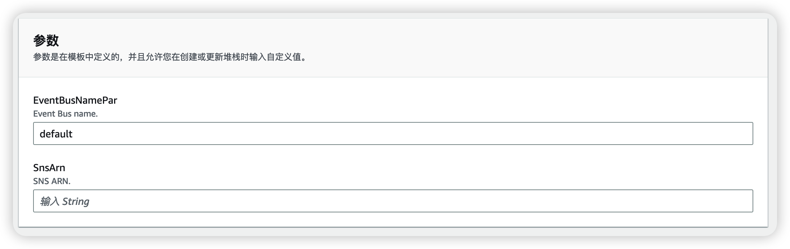

# aws-serverless-notifier-plugin

### Getting started
This project demonstrates various sample plugins for AWS serverless notifier.

### Pre-request
- [ ] Project [AWS-Lambda-notifier](https://github.com/Chris-wa-He/AWS-Lambda-notifier) is required before deploy plug-in in this project.

### How to deploy
Get the event bus name of the Event Bridge and the ARN of the SNS topic in the project AWS-Lambda-notifier. Fill in the template parameters for deploying CloudFormation.

For special settings, please refer to the plugin's README file (if available).

## Security

See [CONTRIBUTING](CONTRIBUTING.md#security-issue-notifications) for more information.

## License

This library is licensed under the MIT-0 License. See the LICENSE file.

