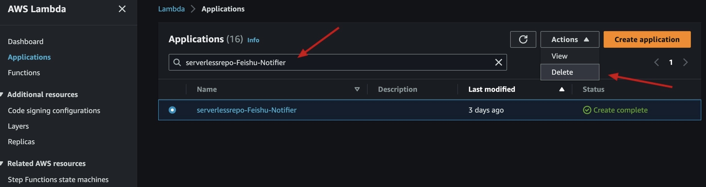

# EKS-Upgrade-Notifier

Serverless EKS Upgrade Notifier

Available on the [AWS Serverless Application Repository](https://aws.amazon.com/serverless)

# Install Notifier

To open `Serverless Application Repository` in the AWS Management Console:

1. Login to the [AWS Management Console](https://console.aws.amazon.com).
2. From the `Services` menu at the top of the console, select `Services`.
3. Under `Compute`, select `Serverless Application Repository`.
4. Type `notifier` in the search input box and enter to search.
5. Select the `*-Notifier` method that you want to use.
6. After deployment, copy the `ARN` of the `SNS Topic` to the clipboard.

# Install EKS Upgrade Notifier

Based on notifier you selected, deploy this application will publish notification messages to your `SNS Topic`.

1. Select the `EKS-Upgrade-Notifier` method that you want to use.

   

2. Enter the `ARN` of SNS Topic.

   

# Delete EKS Upgrade Notifier

If you want to uninstall this application, you can go to the console: `AWS Lambda` -> `Applications`, find your
application, and select delete.

